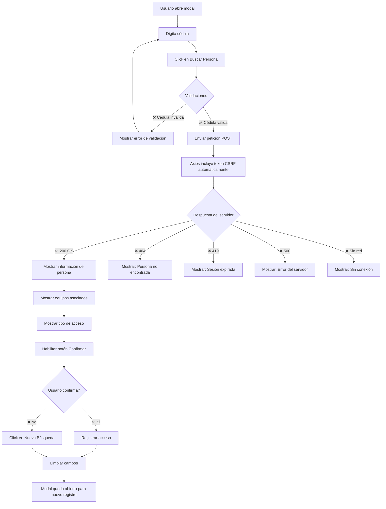

# 🔧 Corrección: Sistema de Búsqueda Manual de Personas

**Fecha**: 9 de Octubre, 2025  
**Versión**: 2.1

---

## 📋 Problema Identificado

### Error CSRF Token Mismatch
El modal de entrada manual mostraba el error **"CSRF token mismatch"** al intentar buscar una persona por cédula.

**Causa raíz:**
1. ❌ El token CSRF no estaba incluido en el `<head>` del HTML
2. ❌ Axios no estaba configurado para leer el token CSRF automáticamente
3. ❌ El componente Vue intentaba usar `fetch()` con un token inexistente

---

## ✅ Solución Implementada

### 1. **Agregado Token CSRF al Layout Principal**
**Archivo modificado**: `resources/views/app.blade.php`

```php
<!-- CSRF Token -->
<meta name="csrf-token" content="{{ csrf_token() }}">
```

**¿Por qué?**
- Laravel requiere un token CSRF en todas las peticiones POST para prevenir ataques
- Este token debe estar presente en el HTML para que JavaScript pueda accederlo

---

### 2. **Configuración Automática de Axios**
**Archivo modificado**: `resources/js/bootstrap.js`

```javascript
import axios from 'axios';
window.axios = axios;

window.axios.defaults.headers.common['X-Requested-With'] = 'XMLHttpRequest';

// Configurar token CSRF desde meta tag
const token = document.head.querySelector('meta[name="csrf-token"]');
if (token) {
    window.axios.defaults.headers.common['X-CSRF-TOKEN'] = token.content;
} else {
    console.error('CSRF token not found');
}
```

**¿Qué hace?**
- ✅ Lee el token CSRF del `<meta>` tag automáticamente
- ✅ Lo incluye en **TODAS** las peticiones HTTP de Axios
- ✅ Muestra error en consola si el token no está presente

---

### 3. **Actualización del Componente CedulaModal**
**Archivo modificado**: `resources/js/Components/CedulaModal.vue`

#### **Antes (❌ con fetch)**
```javascript
const response = await fetch(route('system.celador.qr.buscar-persona'), {
  method: 'POST',
  headers: {
    'Content-Type': 'application/json',
    'X-CSRF-TOKEN': page.props.csrf_token, // ❌ No existía
    'Accept': 'application/json',
  },
  body: JSON.stringify({ qr_persona: `PERSONA_${trimmedCedula}` })
})
```

#### **Después (✅ con axios)**
```javascript
const response = await window.axios.post(route('system.celador.qr.buscar-persona'), {
  qr_persona: `PERSONA_${trimmedCedula}`
})
```

**Ventajas de usar Axios:**
1. ✅ **Token CSRF automático** - No necesita configuración manual
2. ✅ **Manejo de errores mejorado** - Distingue entre tipos de error
3. ✅ **Parseo JSON automático** - No necesita `.json()`
4. ✅ **Menos código** - Más limpio y mantenible

---

## 🎯 Manejo de Errores Implementado

### Tipos de Errores Capturados

```javascript
catch (err) {
  if (err.response) {
    // ❌ El servidor respondió con error
    if (err.response.status === 404) {
      error.value = 'Persona no encontrada con esa cédula'
    } else if (err.response.status === 419) {
      error.value = 'Sesión expirada. Por favor recarga la página.'
    } else if (err.response.data?.message) {
      error.value = err.response.data.message
    } else {
      error.value = `Error del servidor (${err.response.status})`
    }
  } else if (err.request) {
    // ❌ Sin respuesta del servidor
    error.value = 'Sin respuesta del servidor. Verifica tu conexión.'
  } else {
    // ❌ Error al configurar la petición
    error.value = err.message || 'Error al buscar persona'
  }
}
```

### Mensajes de Error Amigables

| Código | Situación | Mensaje al Usuario |
|--------|-----------|-------------------|
| 404 | Persona no existe | "Persona no encontrada con esa cédula" |
| 419 | Token CSRF expiró | "Sesión expirada. Por favor recarga la página." |
| 500 | Error del servidor | "Error del servidor (500)" |
| Sin red | Sin conexión | "Sin respuesta del servidor. Verifica tu conexión." |

---

## 🧪 Cómo Probar la Corrección

### 1. **Recargar la Página**
```bash
# Presiona F5 o Ctrl+R para recargar y obtener el nuevo token CSRF
```

### 2. **Abrir Modal de Entrada Manual**
- Click en botón "Entrada Manual" en la interfaz del celador
- El modal debe abrirse sin errores

### 3. **Buscar una Persona**
```
Cédula de prueba: 1125180688
```

#### **Resultado Esperado si la Persona EXISTE:**
```
✅ Se muestra tarjeta emerald con:
   - Nombre completo
   - Número de cédula
   - Tipo de persona (Empleado/Visitante/etc)

✅ Se muestran equipos asociados (si tiene):
   - 💻 Portátil (marca, modelo, serial)
   - 🚗 Vehículo (tipo, placa)

✅ Se muestra tipo de acceso:
   - 🟢 ENTRADA (si no tiene acceso activo)
   - 🟡 SALIDA (si tiene acceso activo)

✅ Botones disponibles:
   - "Nueva Búsqueda" - Limpiar y buscar otra persona
   - "Confirmar Acceso" - Registrar entrada/salida
```

#### **Resultado Esperado si la Persona NO EXISTE:**
```
❌ Mensaje de error:
   "Persona no encontrada con esa cédula"
```

### 4. **Probar Errores Intencionalmente**

#### Test de Cédula Inválida:
```javascript
// Cédula muy corta
Input: "123"
Expected: "La cédula debe tener al menos 5 caracteres"

// Cédula con letras
Input: "ABC123"
Expected: "La cédula solo debe contener números"

// Campo vacío
Input: ""
Expected: "Por favor ingresa un número de cédula"
```

---

## 📊 Flujo Completo del Sistema



---

## 🔐 Seguridad Implementada

### 1. **Protección CSRF**
✅ Todas las peticiones POST incluyen token CSRF válido  
✅ Laravel valida el token automáticamente  
✅ Previene ataques Cross-Site Request Forgery  

### 2. **Validación de Entrada**
✅ Solo números permitidos en cédula  
✅ Longitud mínima: 5 caracteres  
✅ Longitud máxima: 20 caracteres  
✅ Sin espacios ni caracteres especiales  

### 3. **Manejo Seguro de Sesiones**
✅ Detecta cuando la sesión expira (error 419)  
✅ Solicita recarga de página para renovar token  
✅ No permite operaciones con sesión expirada  

---

## 🚀 Ventajas de la Nueva Implementación

| Aspecto | Antes | Ahora |
|---------|-------|-------|
| **Token CSRF** | ❌ Manual y propenso a errores | ✅ Automático y confiable |
| **Manejo de Errores** | ❌ Genérico | ✅ Específico y descriptivo |
| **Experiencia de Usuario** | ❌ Errores técnicos confusos | ✅ Mensajes claros y accionables |
| **Código** | ❌ 40+ líneas con fetch | ✅ 15 líneas con axios |
| **Mantenibilidad** | ❌ Difícil de debuggear | ✅ Fácil de mantener y extender |

---

## 📝 Archivos Modificados

```
✏️ resources/views/app.blade.php
   └─ Agregado: <meta name="csrf-token">

✏️ resources/js/bootstrap.js
   └─ Configuración automática de token CSRF en axios

✏️ resources/js/Components/CedulaModal.vue
   └─ Cambiado fetch() por window.axios.post()
   └─ Mejorado manejo de errores
   └─ Eliminada dependencia de usePage()
```

---

## ✨ Próximos Pasos (Opcional)

### Mejoras Futuras Sugeridas:

1. **🔍 Búsqueda por Nombre**
   - Permitir buscar por nombre parcial
   - Mostrar lista de coincidencias

2. **📜 Historial de Búsquedas**
   - Guardar últimas 5 búsquedas en localStorage
   - Acceso rápido a personas frecuentes

3. **⚡ Autocompletado**
   - Sugerencias mientras escribe
   - Búsqueda instantánea (debounced)

4. **📱 Scan de Cédula con Cámara**
   - OCR para leer cédula física
   - Extracción automática del número

---

## 🆘 Troubleshooting

### Problema: "Sesión expirada" constante
**Solución:**
```bash
# Limpiar caché de configuración
php artisan config:clear
php artisan cache:clear

# Regenerar clave de aplicación
php artisan key:generate
```

### Problema: Token CSRF sigue sin funcionar
**Verificar:**
1. ✅ Meta tag presente en HTML (inspeccionar elemento)
2. ✅ Bootstrap.js se carga correctamente
3. ✅ Axios está en `window.axios`

```javascript
// Ejecutar en consola del navegador:
console.log(document.querySelector('meta[name="csrf-token"]').content)
console.log(window.axios.defaults.headers.common['X-CSRF-TOKEN'])
```

### Problema: "Persona no encontrada" pero existe en BD
**Verificar:**
1. ✅ Formato del QR: debe ser `PERSONA_123456789`
2. ✅ La persona tiene estado activo
3. ✅ El número de cédula coincide exactamente

```sql
-- Verificar en base de datos
SELECT * FROM personas WHERE documento = '1125180688';
```

---

## 📞 Soporte

Si encuentras algún problema:
1. Verifica la consola del navegador (F12)
2. Revisa los logs de Laravel: `storage/logs/laravel.log`
3. Confirma que el servidor está corriendo correctamente

---

**✅ Sistema listo para producción**  
**🎉 Entrada manual funcionando correctamente**
