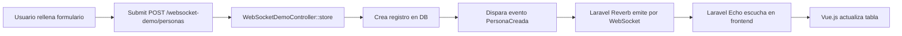

# 🚀 Demo Completo: Laravel 12 + Reverb WebSockets

## 📋 Descripción General

Este es un ejemplo funcional y completo de WebSockets en tiempo real usando **Laravel 12** con **Laravel Reverb**. 

### ✨ Funcionalidades

- ✅ Crear personas desde un formulario
- ✅ Ver la lista de personas en una tabla
- ✅ Actualización automática en tiempo real sin recargar la página
- ✅ Eventos broadcasting: `PersonaCreada` y `PersonaActualizada`
- ✅ Log de eventos en tiempo real
- ✅ Indicador de conexión WebSocket

---

## 🎯 Stack Tecnológico

- **Backend**: Laravel 12 (PHP 8.2+)
- **WebSockets**: Laravel Reverb (nativo)
- **Frontend**: Vue.js 3 + Tailwind CSS
- **Broadcasting**: Laravel Echo + Pusher JS
- **Base de datos**: MySQL

---

## 📂 Estructura de Archivos Creados

```
app/
├── Events/
│   ├── PersonaCreada.php          # Evento cuando se crea una persona
│   └── PersonaActualizada.php     # Evento cuando se actualiza una persona
│
├── Http/Controllers/
│   └── WebSocketDemoController.php  # Controlador del demo
│
├── Models/
│   └── Persona.php                  # Modelo existente

routes/
├── web.php                          # Rutas del demo agregadas
└── channels.php                     # Canal público 'personas'

resources/
├── js/
│   └── echo.js                      # Configuración de Laravel Echo
│
└── views/
    └── websocket-demo/
        └── index.blade.php          # Vista principal con tabla en tiempo real

.env.reverb.example                  # Variables de entorno necesarias
```

---

## 🔧 Configuración Paso a Paso

### **Paso 1: Verificar que Reverb está instalado**

```bash
composer require laravel/reverb
php artisan reverb:install
```

### **Paso 2: Instalar dependencias de JavaScript**

```bash
npm install --save laravel-echo pusher-js
```

### **Paso 3: Configurar variables de entorno**

Tu archivo `.env` ya contiene las configuraciones correctas:

```env
BROADCAST_DRIVER=reverb
BROADCAST_CONNECTION=reverb

REVERB_APP_ID=local
REVERB_APP_KEY=testkey
REVERB_APP_SECRET=testsecret

REVERB_HOST=127.0.0.1
REVERB_PORT=8080
REVERB_SCHEME=http

VITE_REVERB_APP_KEY="${REVERB_APP_KEY}"
VITE_REVERB_HOST="${REVERB_HOST}"
VITE_REVERB_PORT="${REVERB_PORT}"
VITE_REVERB_SCHEME="${REVERB_SCHEME}"
```

### **Paso 4: Verificar la tabla `personas`**

Asegúrate de que la tabla `personas` existe. Si no, ejecuta las migraciones:

```bash
php artisan migrate
```

### **Paso 5: Compilar los assets**

```bash
npm run dev
```

---

## 🚀 Cómo Ejecutar el Demo

### **Opción 1: Tres terminales separadas (Recomendado)**

**Terminal 1 - Servidor Laravel:**
```bash
php artisan serve
```

**Terminal 2 - Servidor Reverb:**
```bash
php artisan reverb:start
```

**Terminal 3 - Compilación de Assets:**
```bash
npm run dev
```

### **Opción 2: Un solo comando con concurrently**

Si tienes `concurrently` instalado (ya lo tienes en tu `package.json`):

```bash
npm run dev
```

Luego en otra terminal:
```bash
php artisan serve & php artisan reverb:start
```

---

## 🌐 Acceder al Demo

Una vez que los servidores estén corriendo, abre tu navegador en:

```
http://localhost:8000/websocket-demo
```

---

## 🧪 Probar el Sistema

### **Prueba 1: Crear una persona**

1. Llena el formulario con datos de una persona
2. Haz clic en "✚ Crear"
3. **Verás que la tabla se actualiza automáticamente**
4. El log de eventos mostrará: `🎉 Evento recibido: persona.creada`

### **Prueba 2: Abrir múltiples pestañas**

1. Abre la URL en 2 o más pestañas del navegador
2. Crea una persona en una pestaña
3. **Todas las demás pestañas se actualizarán automáticamente** ✨

### **Prueba 3: Verificar los eventos en el backend**

Revisa los logs de Laravel:

```bash
tail -f storage/logs/laravel.log
```

Deberías ver:
```
[2025-10-11 10:30:45] local.INFO: Persona creada y evento emitido {"persona_id":123}
```

---

## 📡 Cómo Funciona el Sistema

### **1. El Flujo Completo**



### **2. Eventos de Broadcasting**

**`PersonaCreada.php`**
```php
// Se emite en el canal público 'personas'
public function broadcastOn(): Channel
{
    return new Channel('personas');
}

// Nombre del evento
public function broadcastAs(): string
{
    return 'persona.creada';
}
```

### **3. Escucha en el Frontend**

**`index.blade.php` (Vue.js)**
```javascript
window.Echo.channel('personas')
    .listen('.persona.creada', (data) => {
        console.log('Nueva persona:', data);
        this.personas.unshift(data); // Agregar a la tabla
    });
```

---

## 🔍 Debugging

### **Problema: No se conecta al WebSocket**

**Solución:**
1. Verifica que Reverb esté corriendo: `php artisan reverb:start`
2. Revisa la consola del navegador (F12)
3. Verifica las variables de entorno en `.env`

### **Problema: Los eventos no se emiten**

**Solución:**
1. Verifica que `BROADCAST_DRIVER=reverb` en `.env`
2. Revisa los logs: `tail -f storage/logs/laravel.log`
3. Asegúrate de que el canal esté definido en `routes/channels.php`

### **Problema: Error 500 al crear persona**

**Solución:**
1. Revisa los logs de Laravel
2. Verifica que la tabla `personas` existe
3. Asegúrate de que los campos required existen en la tabla

---

## 📝 Código Importante

### **Disparar un evento manualmente**

En cualquier parte de tu código Laravel:

```php
use App\Events\PersonaCreada;
use App\Models\Persona;

$persona = Persona::find(1);
event(new PersonaCreada($persona));
```

### **Escuchar eventos en JavaScript**

```javascript
window.Echo.channel('personas')
    .listen('.persona.creada', (data) => {
        console.log('Persona creada:', data);
    })
    .listen('.persona.actualizada', (data) => {
        console.log('Persona actualizada:', data);
    });
```

---

## 🎨 Personalización

### **Cambiar el puerto de Reverb**

En `.env`:
```env
REVERB_PORT=8081
VITE_REVERB_PORT=8081
```

Luego reinicia Reverb:
```bash
php artisan reverb:start
```

### **Usar HTTPS en producción**

En `.env`:
```env
REVERB_SCHEME=https
VITE_REVERB_SCHEME=https
```

### **Crear canales privados**

En `routes/channels.php`:
```php
Broadcast::channel('personas.{id}', function ($user, $id) {
    return $user->id === (int) $id;
});
```

---

## 📚 Recursos Adicionales

- [Documentación oficial de Laravel Broadcasting](https://laravel.com/docs/11.x/broadcasting)
- [Laravel Reverb](https://reverb.laravel.com)
- [Laravel Echo](https://laravel.com/docs/11.x/broadcasting#client-side-installation)

---

## ✅ Checklist de Verificación

- [ ] Reverb instalado (`composer require laravel/reverb`)
- [ ] Dependencias JS instaladas (`npm install laravel-echo pusher-js`)
- [ ] Variables de entorno configuradas (`.env`)
- [ ] Tabla `personas` migrada
- [ ] Servidor Laravel corriendo (`php artisan serve`)
- [ ] Servidor Reverb corriendo (`php artisan reverb:start`)
- [ ] Assets compilados (`npm run dev`)
- [ ] Demo accesible en `http://localhost:8000/websocket-demo`

---

## 🎉 ¡Listo!

Ahora tienes un sistema completo de WebSockets en tiempo real con Laravel Reverb. 

**Para probar:**
1. Ve a `http://localhost:8000/websocket-demo`
2. Crea una persona
3. Abre otra pestaña y verás la actualización en tiempo real ✨

---

## 👨‍💻 Autor

Sistema de Control de Acceso - CTAccess  
Demo de WebSockets con Laravel 12 + Reverb
