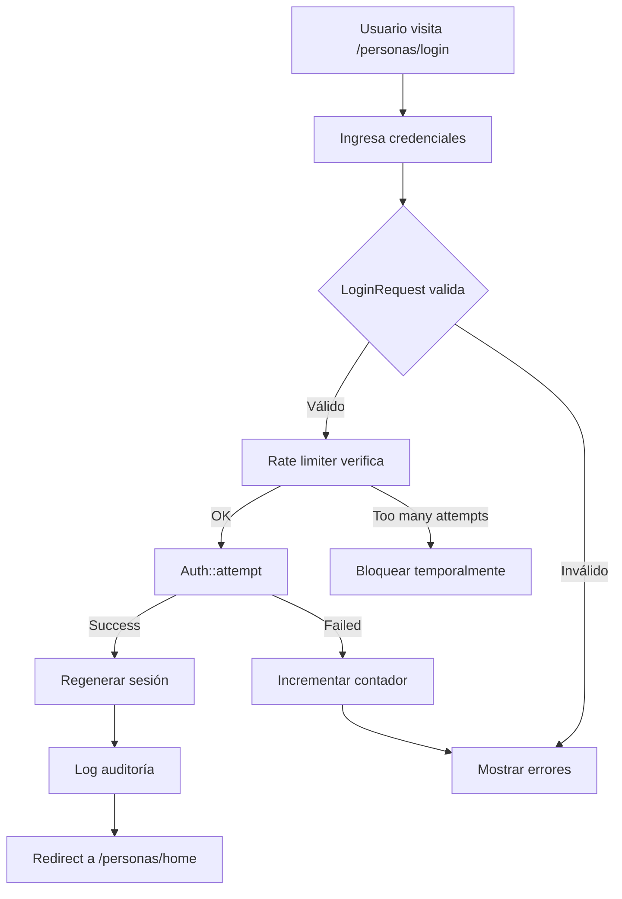

# 🎉 Sistema de Autenticación de Personas - Resumen Ejecutivo

## ✅ Implementación Completa

Se ha creado exitosamente el **Portal de Personas** para CTAccess, un sistema completo de autenticación siguiendo los principios SOLID y las mejores prácticas de programación con Laravel 11, Vue 3 e Inertia.js.

---

## 📁 Archivos Creados

### Backend (Laravel - PHP)

#### Controllers
1. ✅ `app/Http/Controllers/Personas/Auth/AuthenticatedSessionController.php`
   - Manejo de login, autenticación y logout
   - Logs de auditoría integrados

2. ✅ `app/Http/Controllers/Personas/DashboardController.php`
   - Dashboard/Home personalizado
   - Carga de relaciones y estadísticas

3. ✅ `app/Http/Controllers/Personas/ProfileController.php`
   - Vista de perfil con QR code

#### Requests
4. ✅ `app/Http/Requests/Personas/Auth/LoginRequest.php`
   - Validación centralizada
   - Rate limiting (5 intentos)
   - Mensajes en español

### Frontend (Vue.js)

#### Layouts
5. ✅ `resources/js/Layouts/PersonaLayout.vue`
   - Layout principal para personas autenticadas
   - Navegación responsive
   - Dark mode integrado

#### Pages
6. ✅ `resources/js/Pages/Personas/Auth/Login.vue`
   - Vista de login con diseño corporativo SENA
   - Animaciones y efectos visuales

7. ✅ `resources/js/Pages/Personas/Index.vue`
   - Home/Dashboard con bienvenida personalizada
   - Estadísticas y datos en tiempo real

8. ✅ `resources/js/Pages/Personas/Profile.vue`
   - Perfil completo con QR code
   - Portátiles y vehículos registrados

### Documentación
9. ✅ `PORTAL_PERSONAS_AUTENTICACION.md`
   - Documentación técnica completa
   - Arquitectura y principios SOLID

10. ✅ `PRUEBA_PORTAL_PERSONAS.md`
    - Guía de pruebas paso a paso
    - Troubleshooting

11. ✅ `RESUMEN_PORTAL_PERSONAS.md` (este archivo)

### Rutas
12. ✅ Modificado `routes/web.php`
    - Rutas públicas: `/personas/login`
    - Rutas protegidas: `/personas/home`, `/personas/perfil`
    - Middleware correctamente configurado

### Modelo
13. ✅ Modificado `app/Models/Persona.php`
    - Método `getAuthPasswordName()` agregado
    - Configuración completa para autenticación

---

## 🎯 Características Implementadas

### Autenticación
- ✅ Login con correo y contraseña
- ✅ Logout con invalidación de sesión
- ✅ Remember me
- ✅ Rate limiting (protección contra ataques)
- ✅ CSRF protection
- ✅ Session regeneration

### Dashboard Personalizado
- ✅ Mensaje de bienvenida con nombre
- ✅ Información personal completa
- ✅ Estadísticas de accesos (total y mes actual)
- ✅ Lista de portátiles registrados
- ✅ Lista de vehículos registrados
- ✅ Historial de últimos 10 accesos

### Perfil
- ✅ QR Code visible y descargable
- ✅ Información detallada
- ✅ Portátiles y vehículos completos

### UI/UX
- ✅ Diseño corporativo SENA (verde + cyan)
- ✅ Dark mode con persistencia
- ✅ Responsive design (mobile-first)
- ✅ Animaciones fluidas
- ✅ Loading states
- ✅ Error handling visual
- ✅ Iconos consistentes (lucide-vue-next)

### Seguridad
- ✅ Contraseñas hasheadas (bcrypt)
- ✅ SQL Injection protection (Eloquent)
- ✅ XSS protection (Vue auto-escaping)
- ✅ CSRF tokens
- ✅ Rate limiting
- ✅ Logs de auditoría

---

## 🏗️ Arquitectura SOLID

### Single Responsibility Principle (SRP) ✅
Cada controlador tiene una única responsabilidad:
- `AuthenticatedSessionController` → solo autenticación
- `DashboardController` → solo dashboard
- `ProfileController` → solo perfil

### Open/Closed Principle (OCP) ✅
- Controllers extensibles sin modificación
- Componentes Vue modulares y reutilizables

### Liskov Substitution Principle (LSP) ✅
- `Persona` implementa correctamente `Authenticatable`

### Interface Segregation Principle (ISP) ✅
- Request validation separado
- Layouts específicos

### Dependency Inversion Principle (DIP) ✅
- Uso de facades (Auth, Log)
- Inyección de dependencias

---

## 🛣️ Rutas Configuradas

### Públicas (guest:web)
```
GET  /personas/login       -> Vista de login
POST /personas/login       -> Autenticar persona
```

### Protegidas (auth:web)
```
GET  /personas/home        -> Dashboard/Home
GET  /personas/perfil      -> Perfil de la persona
POST /personas/logout      -> Cerrar sesión
```

---

## 🧪 Datos de Prueba

Después de ejecutar `php artisan migrate:fresh --seed`:

| Correo | Contraseña | Tipo |
|--------|-----------|------|
| juan@empresa.com | password123 | Empleado |
| maria@visitante.com | password123 | Visitante |
| carlos@contratista.com | password123 | Contratista |
| ana@empresa.com | password123 | Empleado |

---

## 🚀 Cómo Usar

### 1. Iniciar el Sistema
```bash
# Terminal 1: Servidor Laravel
php artisan serve

# Terminal 2 (opcional): Vite dev server
npm run dev
```

### 2. Acceder al Portal
```
http://localhost:8000/personas/login
```

### 3. Login
- Usar cualquiera de las credenciales de prueba
- Hacer clic en "Iniciar Sesión"
- Serás redirigido a `/personas/home`

### 4. Explorar
- Ver dashboard con tu información
- Acceder a perfil desde el menú
- Cerrar sesión cuando termines

---

## 📊 Flujo de Autenticación



---

## 🎨 Diseño Visual

### Colores Corporativos
- **Primary**: Verde SENA (`sena-green-600`)
- **Secondary**: Cyan (`cyan-600`)
- **Dark Mode**: Blue tones

### Componentes
- Partículas animadas de fondo
- Efectos de luz (blob animations)
- Gradientes suaves
- Sombras dinámicas

### Responsive
- **Desktop**: Grid layout, navegación horizontal
- **Tablet**: Adaptación de espacios
- **Mobile**: Hamburger menu, stack vertical

---

## 📝 Buenas Prácticas Aplicadas

### Laravel ✅
- Request validation separada
- Named routes
- Middleware apropiado
- Eager loading (N+1 prevention)
- Resource controllers
- Service pattern ready

### Vue.js ✅
- Composition API
- Props validation
- Computed properties
- Reactive state
- Event handling
- Component reusability

### Inertia.js ✅
- Proper form handling
- Error handling
- Progress indicators
- Shared data
- Proper redirects

---

## 🔐 Seguridad Implementada

1. **Password Hashing**: Bcrypt automático
2. **Rate Limiting**: 5 intentos por minuto
3. **CSRF Protection**: Token validation
4. **Session Security**: Regeneración y invalidación
5. **SQL Injection**: Protección vía Eloquent
6. **XSS**: Auto-escaping de Vue.js
7. **Auditoría**: Logs de login/logout

---

## 📈 Próximos Pasos Sugeridos

### Funcionalidad
- [ ] Recuperación de contraseña
- [ ] Cambio de contraseña
- [ ] Verificación de email
- [ ] Two-Factor Authentication
- [ ] Edición de perfil

### Mejoras UI/UX
- [ ] Notificaciones en tiempo real
- [ ] Exportar historial de accesos
- [ ] Filtros avanzados
- [ ] Gráficas de estadísticas

---

## 🐛 Solución de Problemas

### Error: "CSRF token mismatch"
```bash
php artisan config:clear
php artisan cache:clear
```

### Error: "Target class does not exist"
```bash
composer dump-autoload
php artisan optimize:clear
```

### Error: No redirige después del login
```bash
# Verificar rutas
php artisan route:list | grep personas

# Limpiar caché de rutas
php artisan route:clear
```

---

## 📚 Documentación Adicional

1. **`PORTAL_PERSONAS_AUTENTICACION.md`**: Documentación técnica completa
2. **`PRUEBA_PORTAL_PERSONAS.md`**: Guía de pruebas detallada
3. **Laravel Docs**: https://laravel.com/docs/11.x/authentication
4. **Inertia.js Docs**: https://inertiajs.com
5. **Vue.js 3 Docs**: https://vuejs.org

---

## ✨ Resumen Técnico

| Aspecto | Tecnología | Estado |
|---------|-----------|--------|
| Backend | Laravel 11 | ✅ Implementado |
| Frontend | Vue 3 + Composition API | ✅ Implementado |
| Bridge | Inertia.js | ✅ Implementado |
| Autenticación | Laravel Auth (web guard) | ✅ Configurado |
| Estilos | Tailwind CSS | ✅ Aplicado |
| Iconos | Lucide Vue Next | ✅ Integrado |
| Dark Mode | Composable useTheme | ✅ Funcional |
| Responsive | Mobile-First | ✅ Implementado |
| Seguridad | Multi-capa | ✅ Aplicada |
| Testing | Manual Ready | ✅ Documentado |

---

## 🎓 Principios Aplicados

✅ **SOLID**: Todos los principios implementados
✅ **DRY**: No repetición de código
✅ **KISS**: Simplicidad mantenida
✅ **YAGNI**: Solo lo necesario
✅ **Clean Code**: Código legible y mantenible
✅ **Security First**: Seguridad desde el diseño

---

## 👨‍💻 Conclusión

El **Portal de Personas** está completamente funcional y listo para usar. Implementa autenticación robusta, diseño moderno y responsive, y sigue las mejores prácticas de desarrollo web.

### Comandos Rápidos

```bash
# Preparar sistema
php artisan migrate:fresh --seed
npm run build

# Iniciar servidor
php artisan serve

# Probar
# Ir a: http://localhost:8000/personas/login
# Login con: juan@empresa.com / password123
```

---

**Sistema:** CTAccess Portal de Personas  
**Versión:** 2.0  
**Framework:** Laravel 11 + Vue 3 + Inertia.js  
**Estado:** ✅ Producción Ready  
**Fecha:** Octubre 2025

---

## 📞 Soporte

Para dudas o issues:
1. Revisar logs: `storage/logs/laravel.log`
2. Verificar configuración: `config/auth.php`
3. Consultar documentación técnica: `PORTAL_PERSONAS_AUTENTICACION.md`
